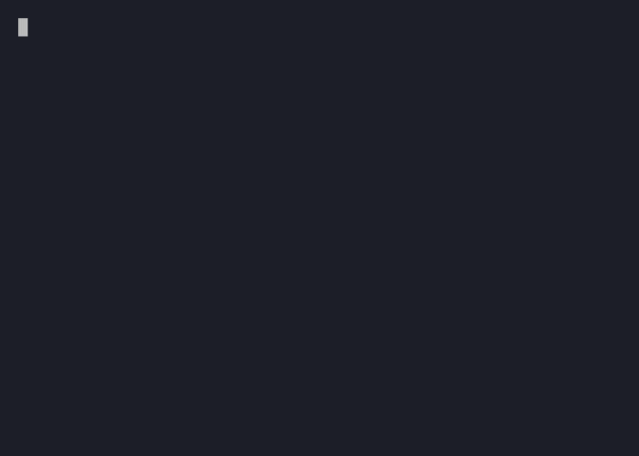

# menu

A cursor-driven, scrollable list of options for [Bubble Tea v2](https://github.com/charmbracelet/bubbletea), backed by an embedded `viewport.Model`. Set a height smaller than the option count and `menu` scrolls internally, showing ▲/▼ indicators for content above/below the visible window.



## Install

```sh
go get github.com/gzigzigzeo/bubbles/menu
```

## Quick start

```go
opts := []menu.Option[string]{
    {Name: "Apple", Value: "apple"},
    {Name: "Banana", Value: "banana"},
    {Name: "Cherry", Value: "cherry"},
}

picker := menu.New(opts)
picker.SetStyles(menu.DefaultStyles())
picker.SetWidth(40) // see "Width" below — New defaults to a fixed 80 columns
picker.SetHeight(5) // only 5 rows visible at once; scrolls past that

// In your model's Init:
func (m Model) Init() tea.Cmd {
    return m.picker.Init()
}

// In your model's Update:
func (m Model) Update(msg tea.Msg) (tea.Model, tea.Cmd) {
    if choice, ok := msg.(menu.ChoiceMsg[string]); ok {
        // choice.Value / choice.Option.Name is the selected row
    }
    _, cmd := m.picker.Update(msg)
    return m, cmd
}

// In your model's View:
func (m Model) View() tea.View {
    return m.picker.View()
}
```

See [`examples/example.go`](./examples/example.go) for a complete runnable demo: 10 options with only 5 visible at once, plus a marker set on one option to show a separately committed value while the cursor is elsewhere.

## Width

`New` always calls `SetWidth` with a fixed default of **80 columns** — it does **not** auto-size to the terminal or to a surrounding layout. If you want the menu to occupy the widest available space, you must call `SetWidth` yourself with that computed width (e.g. your layout's content width), typically right after `New` and again whenever that width can change:

```go
m := menu.New(opts)
m.SetWidth(layout.Width()) // required to claim the full available width
```

Leaving `SetWidth` uncalled after construction means rows stay capped at 80 columns — truncated with `…` if a row is longer, regardless of how wide the actual terminal is.

## Cursor and marker

`menu` tracks two distinct, single-item concepts, never a set of several:

- **Cursor** — the currently highlighted, navigable row (`Cursor()`, moved by Up/Down, positioned by `SetValue`). Pressing Enter fires `ChoiceMsg[T]` for whatever the cursor currently points at.
- **Marker** — a separate "committed" value shown with distinct styling (`CursorMarked`/`LabelMarked`) regardless of where the cursor is, set with `SetMarker`. Useful for showing a field's previously-confirmed value while the user browses other options. Only one marker is supported at a time — calling `SetMarker` again moves it, it doesn't add another.

## Styles

```go
type Styles struct {
    ScrollUp      lipgloss.Style
    ScrollDown    lipgloss.Style
    CursorFocused lipgloss.Style
    CursorBlurred lipgloss.Style
    CursorMarked  lipgloss.Style
    LabelFocused  lipgloss.Style
    LabelBlurred  lipgloss.Style
    LabelMarked   lipgloss.Style
    Description   lipgloss.Style
}
```

`DefaultStyles()` returns a minimal, colorless set using ▶ for the cursor, ▲/▼ for scroll indicators, and ✓ for the marker — override colors and glyphs to match your own theme via `SetStyles`.

## API reference

| Method | Description |
|--------|-------------|
| `New[T comparable](options []Option[T]) *Menu[T]` | Create a menu over `options`; every option is shown with no scrolling until `SetHeight` limits it |
| `SetStyles(Styles)` | Apply style configuration |
| `SetWidth(w int)` | Set the viewport/row width; rows wider than `w` are truncated with `…`. `w <= 0` resets to unlimited (never truncated) |
| `SetHeight(h int)` | Limit visible rows, scrolling internally past that. `h <= 0` resets to unlimited (every option shown) |
| `SetOptions([]Option[T])` | Replace the options; resets the cursor to the first option, leaves the marker untouched |
| `SetMarker(value T)` | Mark the option whose `Value` equals `value` as the separately committed value |
| `SetValue(value T)` | Move the cursor to the option whose `Value` equals `value`, scrolling it into view; no-op if not found |
| `Cursor() T` | The `Value` of the currently highlighted option |
| `CursorLine() int` | The 0-indexed line the cursor is on within `View()`'s rendered output, after internal scrolling |
| `Keys() []key.Binding` | The key bindings this menu responds to, for a caller's own hint bar |
| `Init() tea.Cmd` | Satisfies `tea.Model` |
| `Update(tea.Msg) (tea.Model, tea.Cmd)` | Moves the cursor on Up/Down, fires `ChoiceMsg[T]` on Enter, forwards everything else (including viewport scrolling) |
| `View() tea.View` | Render |
| `ChoiceMsg[T]` | Emitted when the user selects an option: `{Value T; Option *Option[T]}` |
| `Option[T]` | A single row: `{Name string; Description string; Value T}` |

---

Sponsored by [imgproxy](https://imgproxy.net).
