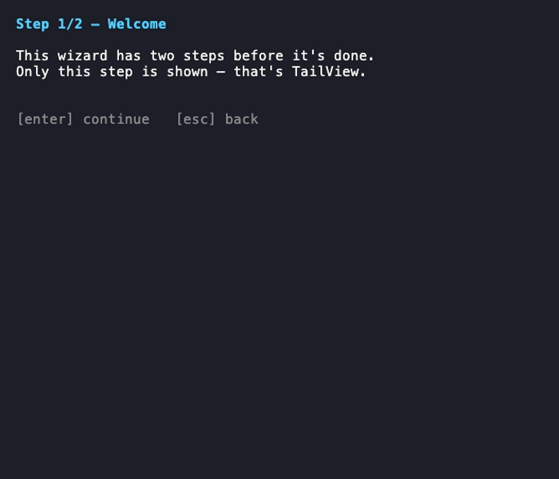

# navstack

A generic navigation stack for [Bubble Tea v2](https://github.com/charmbracelet/bubbletea) apps built from a sequence of screens (`tea.Model`s). Embed `*NavStack[V]` in your root model or in any per-flow model to get `Push`/`Replace`/`Pop` navigation and back-navigation (`BackMsg`) with no bookkeeping of your own.



## Install

```sh
go get github.com/gzigzigzeo/bubbles/navstack
```

## Quick start

Embed `*NavStack[V]` in your model, picking a `V` — `TailView` or `SequenceView` — for how the stack renders. Screens don't need to know about the stack: they just emit their own "I'm done" messages, and the parent embedding the stack decides whether that means `Push`, `Replace`, or something else entirely.

```go
type Flow struct {
    *navstack.NavStack[navstack.TailView]
}

func NewFlow() *Flow {
    return &Flow{NavStack: navstack.New[navstack.TailView](newWelcomeScreen())}
}

func (f *Flow) Update(msg tea.Msg) (tea.Model, tea.Cmd) {
    switch msg := msg.(type) {
    case welcomeDoneMsg:
        return f, f.Push(newDetailsScreen())
    case detailsDoneMsg:
        return f, f.Replace(newSummaryScreen(msg.Data))
    }

    // Everything else — including BackMsg — is handled by the stack itself.
    _, cmd := f.NavStack.Update(msg)
    return f, cmd
}

func (f *Flow) View() tea.View {
    return f.NavStack.View()
}
```

A screen asks to go back by returning `navstack.Back` as its command:

```go
func (s welcomeScreen) Update(msg tea.Msg) (tea.Model, tea.Cmd) {
    if key, ok := msg.(tea.KeyPressMsg); ok && key.String() == "esc" {
        return s, navstack.Back
    }
    return s, nil
}
```

See [`examples/example.go`](./examples/example.go) for a complete runnable wizard built this way — it tours the same steps twice, once on `TailView` and once on `SequenceView`, so you can see both render strategies side by side.

## StackView: TailView vs SequenceView

`NavStack[V]`'s `View()` delegates to `V`'s `View(stack []tea.Model) tea.View`, so `V` controls how the screen stack is composed into one `tea.View`:

- **`TailView`** renders only the topmost screen — the common case for a wizard where each step replaces the last on screen.
- **`SequenceView`** renders every screen in the stack, oldest first, joined vertically, so completed steps stay visible above the active one (e.g. a scrollback-style flow). It preserves the topmost screen's other `tea.View` fields (`AltScreen`, `Cursor`, etc.) — only `Content` is the joined result.

Both are stateless zero-value types, so `navstack.New[V]` needs no extra setup. If you write your own `StackView` with additional state (e.g. sizing), inject it with `WithStrategy` and reach it back via `Strategy()`:

```go
stack.WithStrategy(&mySizingView{width: 80})
stack.Strategy().SomeMethod()
```

## Back-navigation behavior

`Update` gives the top screen first crack at `BackMsg`:

- If the top screen's `Update` returns a **non-nil** command, `NavStack` treats `BackMsg` as handled and does not pop — but it still forwards that command, so any real work the screen requested still runs.
- If it returns **nil** and more than one screen remains, `NavStack` pops, calls `Init()` on the newly revealed screen (so it can reclaim focus — e.g. a text field's cursor), and returns that `Init()` command batched with an internal no-op. The no-op only signals "already handled" to a `NavStack` embedding this one a level up; it carries no observable behavior of its own.
- If it returns nil and this is the only screen left, `Update` returns nil — `Pop` is a no-op at the root, so an outer `NavStack` (if any) can react to the message next.

## API reference

| Method | Description |
|--------|--------------|
| `New[V](initial tea.Model) *NavStack[V]` | Create a stack with `initial` as the first (bottom) screen |
| `Push(screen tea.Model) tea.Cmd` | Add `screen` on top, return its `Init()` command |
| `Replace(screen tea.Model) tea.Cmd` | Swap the top screen for `screen`, return its `Init()` command |
| `Pop()` | Remove the top screen; no-op with only one screen left |
| `Len() int` | Number of screens currently in the stack |
| `Top() tea.Model` | The current top screen |
| `Strategy() V` | The `StackView` backing `View()`, for reaching extra methods on a custom one |
| `WithStrategy(view V) *NavStack[V]` | Set the `StackView` instance backing `View()`; returns the receiver for chaining |
| `Init() tea.Cmd` | Delegates to the top screen's `Init()` (satisfies `tea.Model`) |
| `Update(tea.Msg) (tea.Model, tea.Cmd)` | Handles `BackMsg` per the rules above; delegates everything else to the top screen |
| `View() tea.View` | Delegates to `V`'s composition strategy over the full stack |
| `BackMsg` | Message a screen emits (via `Back`) to ask its stack to go back |
| `Back() tea.Msg` | A `tea.Cmd`-shaped function that returns `BackMsg{}` |

---

Sponsored by [imgproxy](https://imgproxy.net).
