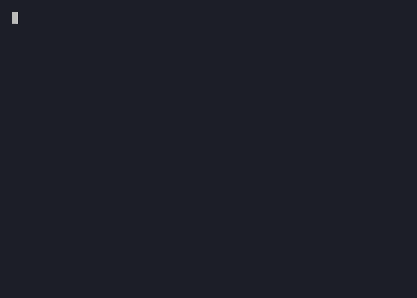

# prompt

A configurable inline prompt bubble for [Bubble Tea v2](https://github.com/charmbracelet/bubbletea) that accepts one of a set of single-character keys and echoes the chosen key inline.



## Install

```sh
go get github.com/gzigzigzeo/bubbles/prompt
```

## Quick start

```go
// Create a y/n prompt.
p := prompt.New("Deploy now? (y/n)", "y", "n")
p.SetStyles(prompt.NewSuccessStyles())

// Optionally make Enter accept a specific key.
p.SetDefault("y")

// In your model's Init:
func (m Model) Init() tea.Cmd {
    return p.Focus()
}

// In your model's Update:
func (m Model) Update(msg tea.Msg) (tea.Model, tea.Cmd) {
    if ans, ok := p.IsMyAnswer(msg); ok {
        if ans == 'y' {
            // user confirmed
        }
    }
    _, cmd := p.Update(msg)
    return m, cmd
}

// In your model's View:
func (m Model) View() string {
    return p.View().Content
}
```

## Styles

```go
type Styles struct {
    Container       lipgloss.Style // total width is Container.GetWidth()
    Icon            lipgloss.Style // use SetString + Width for a fixed-width glyph column
    Label           lipgloss.Style // question text color
    CursorStyle     lipgloss.Style // cursor block style
    CursorTextStyle lipgloss.Style // cursor character style when blinking
    Echo            lipgloss.Style // echoed answer style
}
```

### Built-in presets

| Function            | Color   | Icon |
|---------------------|---------|------|
| `NewWarnStyles()`   | Yellow  | ⚠    |
| `NewErrorStyles()`  | Orange  | !    |
| `NewSuccessStyles()`| Green   | ✓    |
| `NewInfoStyles()`   | Default | i    |

Override the container width after calling a preset:

```go
s := prompt.NewWarnStyles()
s.Container = s.Container.Width(60)
p.SetStyles(s)
```

## API reference

| Method | Description |
|--------|-------------|
| `New(question string, keys ...string) *Prompt` | Create a prompt accepting the given keys |
| `SetStyles(Styles)` | Apply style configuration |
| `SetDefault(key string)` | Make Enter emit this key as the answer |
| `Init() tea.Cmd` | Starts cursor blinking (satisfies `tea.Model`) |
| `Focus() tea.Cmd` | Focus, reset answer, start cursor |
| `Blur()` | Unfocus, stop cursor |
| `Focused() bool` | Report focus state |
| `Update(tea.Msg) (tea.Model, tea.Cmd)` | Handle messages |
| `View() tea.View` | Render |
| `Value() *rune` | Current answer key, nil if unanswered |
| `IsMyAnswer(tea.Msg) (rune, bool)` | Dispatch helper — returns the answer key |

## AnsweredMsg

```go
type AnsweredMsg struct {
    Source *Prompt // which Prompt answered
    Answer rune    // key rune that was pressed, e.g. 'y'
}
```

Use `IsMyAnswer` instead of a raw type assertion to avoid comparing Sources manually:

```go
if ans, ok := p.IsMyAnswer(msg); ok {
    switch ans {
    case 'y': // ...
    case 'n': // ...
    }
}
```

---

Sponsored by [imgproxy](https://imgproxy.net).
